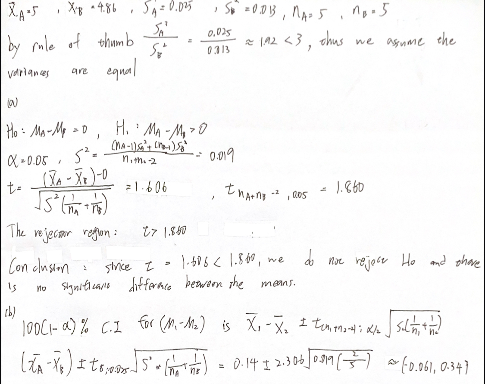

## C10S03Q17

### a.
We use rule of thumb to determine the whether $\sigma_E=\sigma_B$\
If $\frac{s_E^2}{s_B^2} \leq 3$, the equal variance assumption is reasonable.

$\frac{s_E^2}{s_B^2} =  \frac{2.78095}{0.17143} \approx 16.22 > 3$

Therefore, it is more likely for the underlying variances to be different.
### b.
$H_0: \mu_1 - \mu_2 = 0 \quad \quad H_1: \mu_1 - \mu_2 \neq 0$\
$\alpha=0.05$\
df:\
${\text{df}} \approx \frac{(\frac{s_1^2}{n_1} + \frac{s_2^2}{n_2})^2} {\frac{(s_1^2/n_1)^2}{n_1-1} + \frac{(s_2^2/n_1)^2}{n_2-1}} 
= \frac{(\frac{2.78095}{15} + \frac{0.17143}{15})^{2}} {\frac{(2.78095/15)^{2}}{14} + \frac{(0.17143/15)^{2}}{14}} \approx 15.72$

Test satistic:\
$T=(X_1-X_2-D_0)\over sqrt{\frac{S_1^2}{n_1}+\frac{S_2^2}{n_2}}\approx -2.412$\

$-t_{14, 0.05} = -2.145$  
since -2.412 < -2.145  
we reject $H_0$, the means are different
## C10S03Q20

## C10S04Q20

## C10S04Q22

## C10S07Q11
 
## C10S07Q12
 
