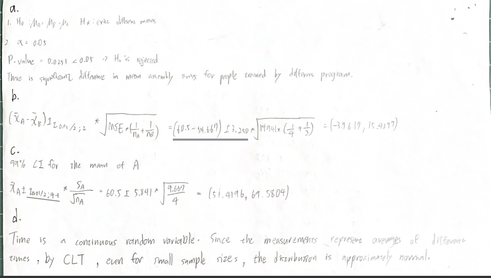
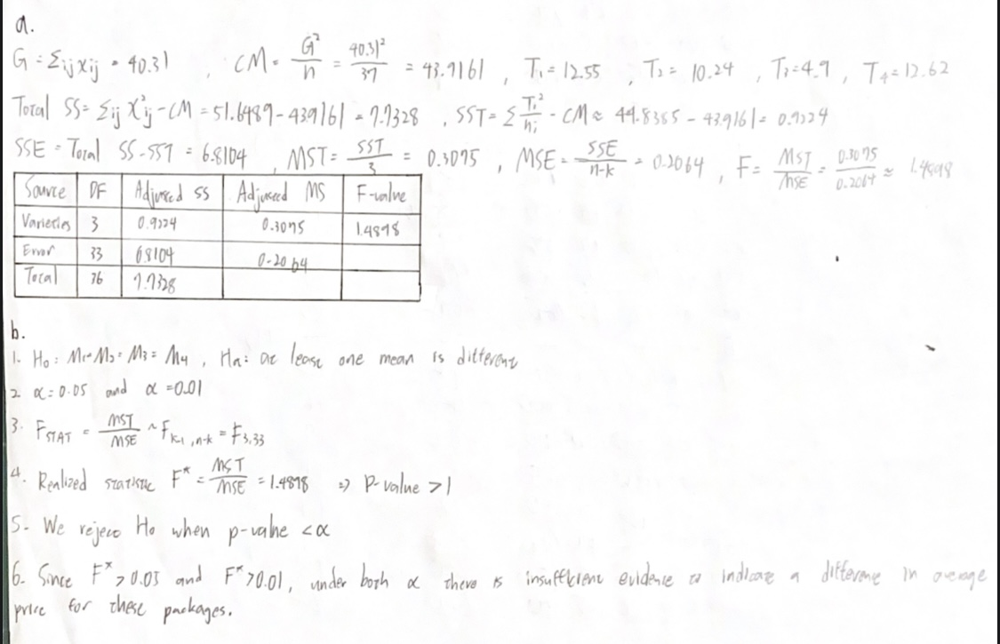
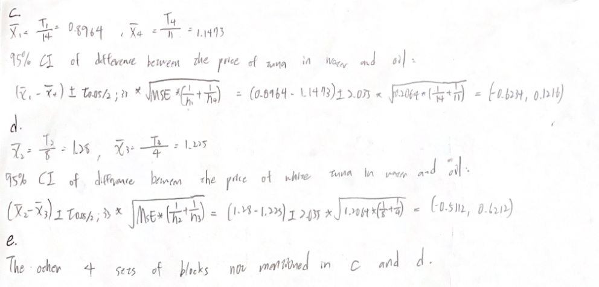
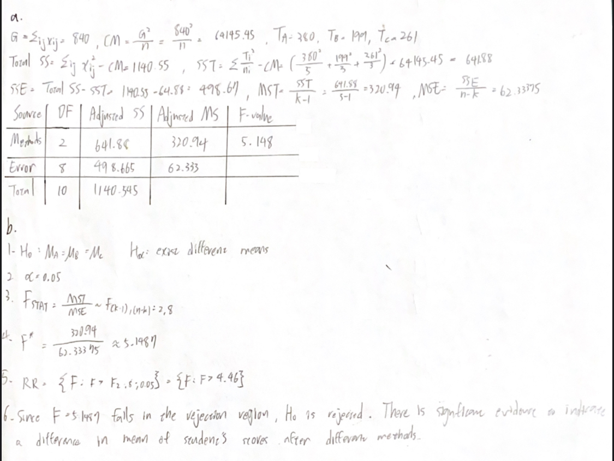

## C11S01Q8,9,14

## Solution of 8
FActor: type of fertilizer
Levels: 3
## Solution of 9
Factor: Daily doses of vitamin C
Levels: 3
## Solution of 14
By CTL, this is binomial distribution $bin~X(100,p)$, and may be a normal distribution.

## C11S02Q10

## C11S02Q14
 

## C11S02Q8

## C11S03Q16

## C11S03Q17
 

## C11S04Q24,25
 

## C11S04Q26
 

